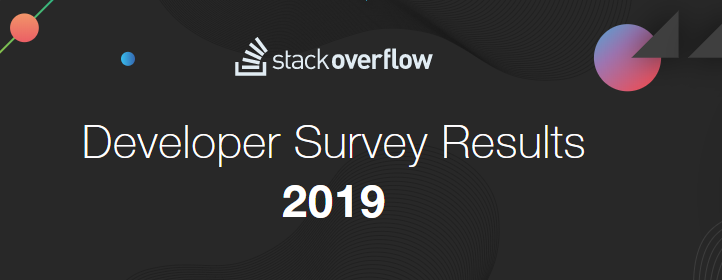

# 004_Udacity_DataScientist_Nanodegree_2nd

||Project|Link|
|:---:|:---:|:---:|
|first|Write a Data Science Blog Post|[Project Link](https://github.com/NamWoo/004_Udacity_DataScientist_Nanodegree_2nd/blob/master/project_survey.ipynb)|
||||

## Project First
*Write a Data Science Blog Post*

>What Is The Difference Between World and South Korea Stackoverflow Users in 2019
This year, nearly 90,000 developers told us how they learn and level up, which tools they’re using, and what they want.

* https://insights.stackoverflow.com/survey/2019

